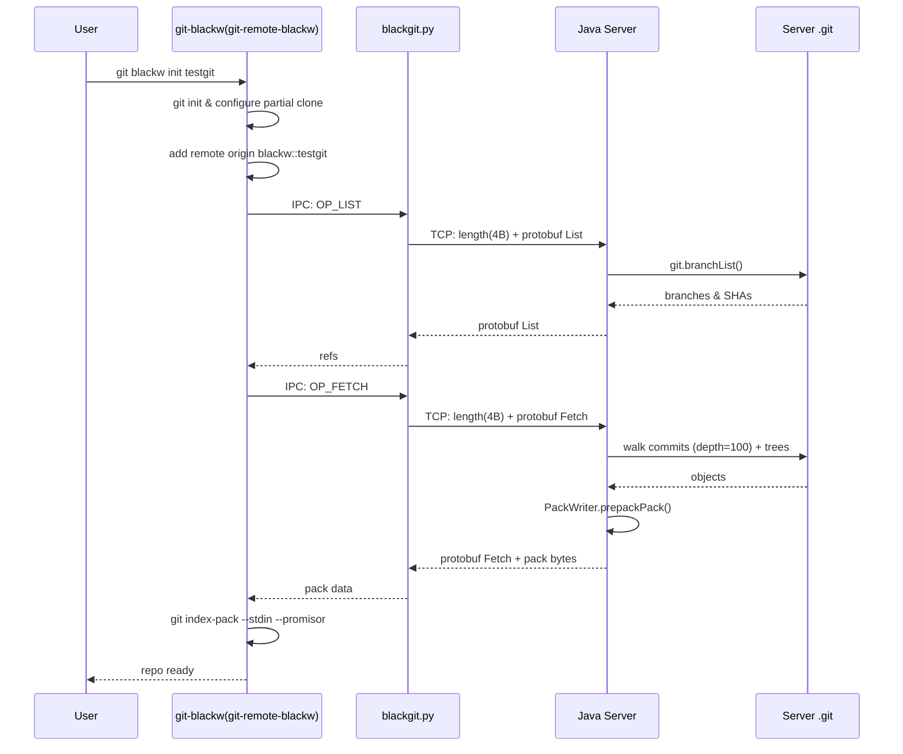
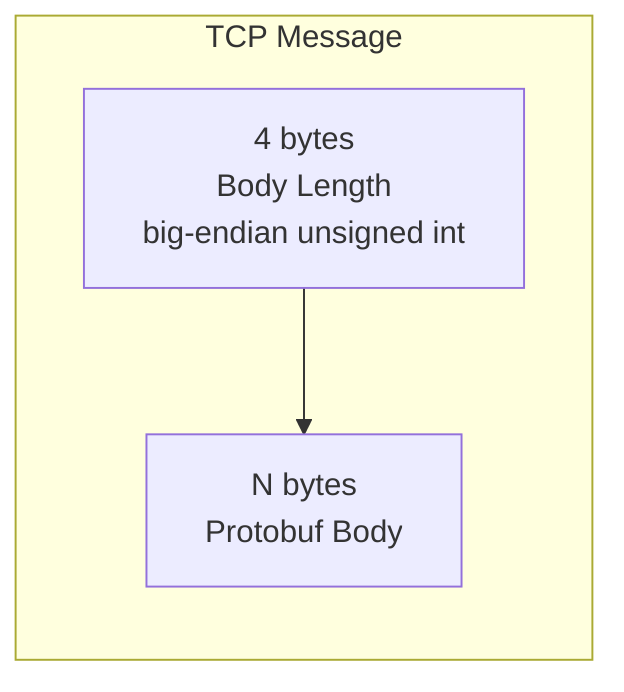
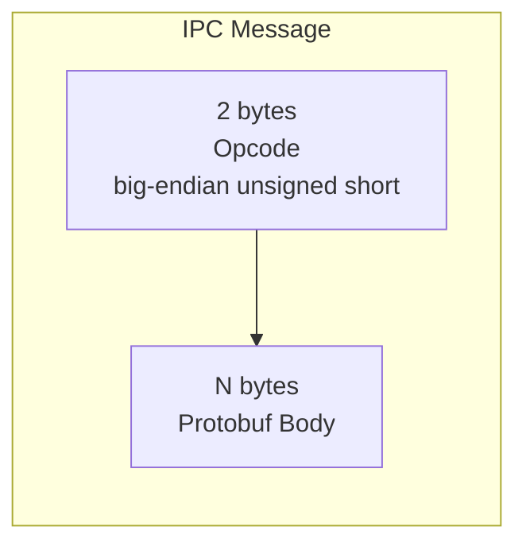

## BlackGit

Inspired by **Perforce** and **Unreal Engine's Lore**, BlackGit bridges the gap between Git's distributed model and the centralized workflows teams need when dealing with large binaries, file locking, and fine-grained permissions — things Perforce is known for.

The core idea: instead of forking Git or building a VCS from scratch, BlackGit is built on top of Git's **remote-helper** protocol with a custom backend server. You still use `git pull`, `git checkout` — but under the hood, a custom server controls what gets fetched, when, and by whom.

---

### How it works

BlackGit uses a **partial clone** strategy(like scalar, but with `combine:blob:none+tree:0`): only minimal metadata is fetched initially, and objects (blobs, trees) are downloaded on-demand. This enables **large file on-demand download** natively — no Git LFS.

The system has three layers:

**1. Git remote helper** (`git-blackw` / `git-remote-blackw`, Python) — Speaks Git's standard remote-helper protocol over stdin/stdout. Handles `fetch`, `list`, `other other commands`, and advertises capabilities like `filter` and `option`. Git discovers it automatically when it's on `PATH`.

**2. IPC bridge** (`blackgit.py`, Python) — A relay process that translates between the remote helper's IPC calls and the server's TCP protocol. Communicates via Unix sockets on macOS/Linux and named pipes on Windows.

**3. Backend server** (Java 21 + JGit) — A TCP server listening on port 1666 that manages refs, generates pack files via JGit's `PackWriter`, and serves objects from a standard `.git` repository.

```
User / Git Client
    │
    ▼
git-blackw(git-remote-blackw)  ──(Unix Socket / Named Pipe)──▶  blackgit.py  ──(TCP :1666)──▶  Java Server
                                                                                   │
                                                                              JGit .git repo
```

The wire protocol is straightforward: TCP messages are a 4-byte big-endian length prefix followed by a Protobuf body. IPC messages use a 2-byte opcode prefix plus Protobuf.

### Data Flow



---

### Protocol Overview

#### Wire Format (TCP — Python ↔ Java Server)



#### IPC Format (git-remote-blackw ↔ blackgit.py)



### Git Remote Helper Commands

`git-remote-blackw` speaks Git's standard remote-helper protocol over stdin/stdout:

| Command | Description |
|---------|-------------|
| `capabilities` | Advertise: fetch, filter, push, list, option |
| `list` | List refs for push or fetch |
| `fetch <sha>` | Fetch objects for given SHA |
| `option <key> <value>` | Set options (verbosity, filter, progress) |

---

### Dual-mode: distributed when you want, centralized when you need

Every BlackGit clone is a real Git repository. You can commit, branch, merge, and rebase offline — all standard Git workflows work unchanged. That's the distributed side.

The centralized side is where the Perforce-like features come in:

- **Native large file handling** — Objects are fetched lazily via partial clone. A 2 GB asset is just a blob that Git downloads when you check it out.
- **File locking** (planned) — `git blackw lock <path>` prevents concurrent edits on binary or critical files, enforced server-side.
- **Fine-grained permissions** (planned) — Read/write access at file and directory level, with ACLs managed by the server.
- **Single source of truth** — The server controls what objects are available and who can access them. Clients only see what they're authorized to fetch.

### An example workflow

Add `git-blackw` to PATH

```bash
export PATH="/path/to/blackgit:$PATH"
```

Add to `~/.zshrc` (macOS) or `~/.bashrc` (Linux) to persist. Git automatically discovers `git-blackw` and `git-remote-blackw` when they are on `PATH`.

```bash
Launching Java Server and blackgit.py
```

```bash
git blackw init testgit

cd testgit
git pull origin main

```

When you `git checkout` a file you haven't touched before, Git's partial clone machinery transparently fetches the required blob from the BlackGit server. From the user's perspective, it feels instant — there's no `lfs pull` or `lfs fetch` to remember.

### Tech stack and platform support

The remote helper and IPC bridge are Python 3.14+. The server is Java 21 with JGit, built using Leiningen (Clojure tooling for the build pipeline). Git 2.54.0 is required for partial clone support.

The IPC layer auto-detects the platform — Unix sockets on macOS and Linux, named pipes on Windows — so the same codebase works across all three. The Java server is portable via the JVM with no platform-specific code.

### What's next

The current implementation covers fetch, and on-demand object retrieval. Push support is the immediate priority — implementing `OP_PUSH` on the server and pack negotiation in the remote helper.

Beyond that, the roadmap includes: multi-threaded server (replacing the current single-threaded NIO loop), token-based authentication, file/directory locking with server-side enforcement, pre-commit and pre-receive hooks for lock and permission checks, and eventually a cross-platform GUI with an embedded IPC bridge.

### (TODO)Extended CLI (`git blackw`)
- [ ] `git blackw sync <path>` — force-sync specific files or directories from server
- [ ] `git blackw lock <path>` — lock a file/directory
- [ ] `git blackw unlock <path>` — unlock
- [ ] `git blackw ls xxx` — do like ls xxx locally
- [ ] `git blackw xxx` — other extended cli commands
