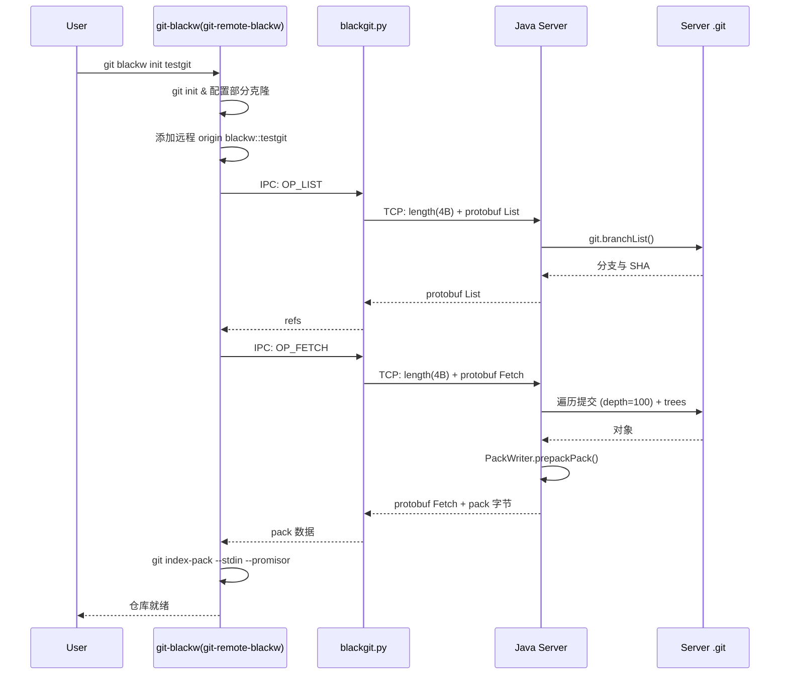
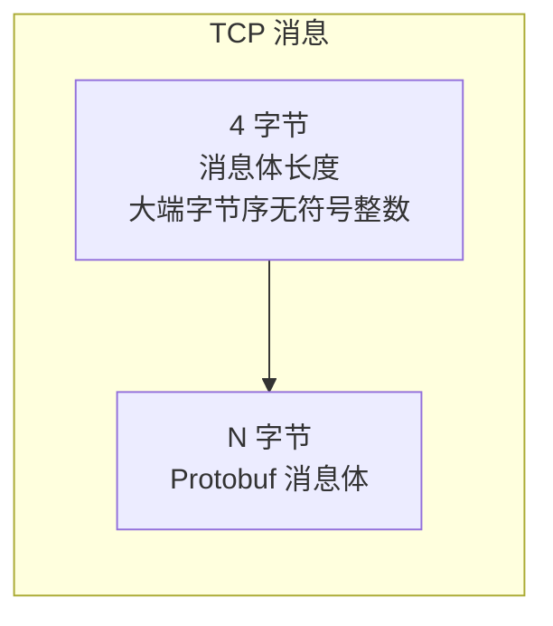
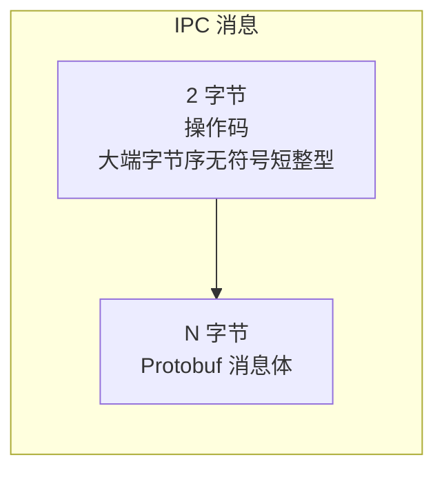

## BlackGit

受 **Perforce** 和 **Unreal Engine 的 Lore** 启发，BlackGit 弥合了 Git 分布式模型与团队在处理大型二进制文件、文件锁定和细粒度权限时所需的集中式工作流之间的鸿沟——这些正是 Perforce 的强项。

核心理念：不是去复刻一个 Git，也不是从头构建一个 VCS，而是基于 Git 的 **remote-helper（远程助手）** 协议构建 BlackGit，并搭配一个自定义后端服务器。你仍然使用 `git pull`、`git checkout`——但在底层，一个自定义服务器控制着什么会被获取、何时获取、由谁获取。

---

### 工作原理

BlackGit 采用 **部分克隆（partial clone）** 策略（类似 scalar，但使用 `combine:blob:none+tree:0`）：初始时只获取最少的元数据，对象（blob、tree）按需下载。这使得 **大文件按需下载** 成为原生能力——无需 Git LFS。

整个系统分为三层：

**1. Git remote helper**（`git-blackw` / `git-remote-blackw`，Python）——通过标准输入/输出与 Git 的标准 remote-helper 协议通信。处理 `fetch`、`list`、`其他命令`，并通告 `filter` 和 `option` 等能力。当它位于 `PATH` 中时，Git 会自动发现它。

**2. IPC 桥**（`blackgit.py`，Python）——一个中继进程，在 remote helper 的 IPC 调用与服务器的 TCP 协议之间进行转换。在 macOS/Linux 上通过 Unix 套接字通信，在 Windows 上通过命名管道通信。

**3. 后端服务器**（Java 21 + JGit）——一个监听 1666 端口的 TCP 服务器，负责管理引用（refs）、通过 JGit 的 `PackWriter` 生成 pack 文件，并从标准的 `.git` 仓库提供对象服务。

```
User / Git Client
    │
    ▼
git-blackw(git-remote-blackw)  ──(Unix Socket / Named Pipe)──▶  blackgit.py  ──(TCP :1666)──▶  Java Server
                                                                                    │
                                                                               JGit .git repo
```

有线协议非常简单：TCP 消息是 4 字节大端字节序的长度前缀加一个 Protobuf 消息体。IPC 消息使用 2 字节操作码前缀加 Protobuf。

### 数据流



---

### 协议概览

#### 线上格式（TCP —— Python ↔ Java 服务器）



#### IPC 格式（git-remote-blackw ↔ blackgit.py）



### Git Remote Helper 命令

`git-remote-blackw` 通过标准输入/输出与 Git 的标准 remote-helper 协议通信：

| 命令 | 描述 |
|---------|-------------|
| `capabilities` | 通告能力：fetch, filter, push, list, option |
| `list` | 列出用于 push 或 fetch 的引用 |
| `fetch <sha>` | 获取给定 SHA 的对象 |
| `option <key> <value>` | 设置选项（verbosity、filter、progress） |

---

### 双模式：想分布式就分布式，需要集中式就集中式

每一个 BlackGit 克隆都是真正的 Git 仓库。你可以离线提交、创建分支、合并和变基——所有标准 Git 工作流都不变。这就是分布式的一面。

集中式的一面正是 Perforce 式功能的来源：

- **原生大文件处理** —— 对象通过部分克隆惰性获取。一个 2 GB 的资源只是一个 blob，在你 checkout 时 Git 才去下载。
- **文件锁定**（规划中）—— `git blackw lock <path>` 可防止对二进制或关键文件的并发编辑，由服务器端强制执行。
- **细粒度权限**（规划中）—— 文件和目录级别的读写权限，ACL 由服务器管理。
- **单一事实来源** —— 服务器控制哪些对象可用、谁能访问。客户端只能看到它们被授权获取的内容。

### 示例工作流

将 `git-blackw` 加入 PATH

```bash
export PATH="/path/to/blackgit:$PATH"
```

加入 `~/.zshrc`（macOS）或 `~/.bashrc`（Linux）以持久化。当 `git-blackw` 和 `git-remote-blackw` 位于 `PATH` 时，Git 会自动发现它们。

```bash
启动 Java 服务器和 blackgit.py
```

```bash
git blackw init testgit

cd testgit
git pull origin main

```

当你 `git checkout` 一个从未接触过的文件时，Git 的部分克隆机制会透明地从 BlackGit 服务器获取所需的 blob。从用户的角度看，它几乎是即时的——无需记得执行 `lfs pull` 或 `lfs fetch`。

### 技术栈与平台支持

remote helper 和 IPC 桥基于 Python 3.14+。服务器基于 Java 21 + JGit，使用 Leiningen（Clojure 构建工具链）构建。部分克隆支持需要 Git 2.54.0 及以上版本。

IPC 层会自动检测平台——在 macOS 和 Linux 上使用 Unix 套接字，在 Windows 上使用命名管道——因此同一套代码可以在这三个平台上运行。Java 服务器通过 JVM 实现可移植，没有平台相关的代码。

### 下一步规划

当前实现覆盖 fetch 和按需对象获取。push 支持是当务之急——在服务器上实现 `OP_PUSH`，并在 remote helper 中实现 pack 协商。

在此之外，路线图还包括：多线程服务器（取代当前的单线程 NIO 循环）、基于令牌的身份认证、带服务器端强制校验的文件/目录锁定、用于锁和权限检查的 pre-commit 与 pre-receive 钩子，以及最终带有内嵌 IPC 桥的跨平台 GUI。

### (TODO)扩展 CLI（`git blackw`）
- [ ] `git blackw sync <path>` —— 从服务器强制同步特定文件或目录
- [ ] `git blackw lock <path>` —— 锁定文件/目录
- [ ] `git blackw unlock <path>` —— 解锁
- [ ] `git blackw ls xxx` —— 像本地 ls xxx 一样工作
- [ ] `git blackw xxx` —— 其他扩展 CLI 命令
